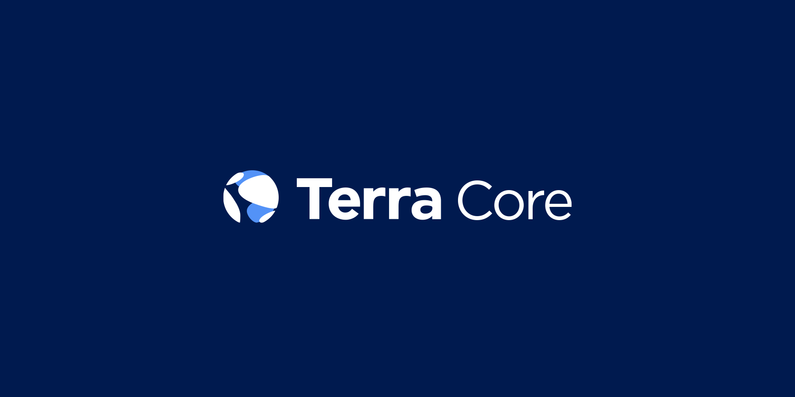

# Terra Core

**[The Terra Protocol](https://terra.money)** facilitates the creation of digital assets _Terra_ that track the value of major fiat currencies.

**Key features:**

- A family of stable-coins pegged to major currencies, at genesis SDR, USD, KRW, JPY, EUR, and CNY.
- Stability achieved by creating mining incentives that are countercyclical to Terra demand
- Delegated Proof-of-Stake (Tendermint) consensus formed over the mining token Luna
- Zero-spread atomic swap amongst Terra currencies.

**Terra Core** is a golang implementation of the Terra Protocol.

Terra Core builds on [Tendermint](https://github.com/tendermint/tendermint) consensus and the [Cosmos SDK](https://github.com/cosmos/cosmos-sdk) toolkits. Please make sure to study these projects as well if you are not already familiar.

**WARNING**: Terra Core has mostly stabilized, but breaking changes may come regularly.

**Note**: Requires [Go 1.12+](https://golang.org/dl/)

## Status

### Network

Public testnet Soju-0005 is online. Currently the Columbus public mainnet is being prepared for launch.

[Testnets](https://github.com/terra-project/networks) contains latest updates to the testnet.

### Terra Alliance

The current state of the Terra Alliance (businesses gearing to adopt Terra upon launch) is summarized [here](https://medium.com/terra-money/state-of-the-terra-alliance-d7f3ff8f6411?fbclid=IwAR2xyZ2sRi_gTHeNPH8tL_VoXpvmDq3sdWMwXaSQCAbHhQGhIEx-yHxWRio)

## Community & Contributions

Community channels actively being managed are here:
- [Website](https://terra.money/)
- [Telegram](https://t.me/terra_announcements)
- [Twitter](https://twitter.com/terra_money)
- [YouTube](https://goo.gl/3G4T1z)

We are currently finalizing contribution standards and guidelines. In the meanwhile, if you are interested in contributing to the Terra Project, please contact our [admin](mailto:general@terra.money).

## Documentation

See the [docs](./docs/guide/README.md) and the [white paper](https://terra.money/static/Terra_White_Paper.pdf).
