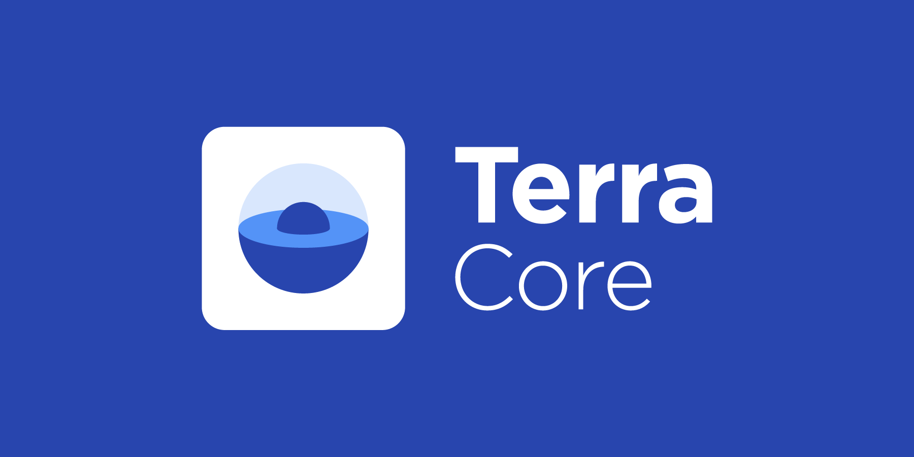

# Terra Core

**[The Terra Protocol](https://terra.money)** facilitates the creation of digital assets _Terra_ that track the value of major fiat currencies.

**Key features:**

- A family of stable-coins pegged to major currencies, e.g. SDR, USD, KRW, JPY, EUR, and CNY.
- Stability achieved by creating mining incentives that are countercyclical to Terra demand
- Delegated Proof-of-Stake (Tendermint) consensus formed over the mining token Luna
- Zero-spread atomic swap amongst Terra currencies.

**Terra Core** is a golang implementation of the Terra Protocol.

Terra Core builds on [Tendermint](https://github.com/tendermint/tendermint) consensus and the [Cosmos SDK](https://github.com/cosmos/cosmos-sdk) toolkits. Please make sure to study these projects as well if you are not already familiar.

**WARNING**: Terra Core has mostly stabilized, but breaking changes may come regularly.

**Note**: Requires [Go 1.13+](https://golang.org/dl/)

## Status

### Network

- Mainnet Columbus-3 is online. [The launch repo](https://github.com/terra-project/launch) contains snapshot of the launch as well as network updates. 

- Public testnet Soju-0013 is online. [Our networks repo](https://github.com/terra-project/networks) contains latest configuration files for the testnet. [The Faucet](https://faucet.terra.money) can be used to get free tokens for the testnet. 

### Ecosystem

- Block Explorers
    - [Terra Finder](https://finder.terra.money)
    - [Figment Hubble](https://hubble.figment.network/terra/chains/columbus-3)
    - [Stake ID by StakingFund](https://terra.stake.id)
    - [Big Dipper by Forbole](https://terra.bigdipper.live/)

- Wallet 
    - [Terra Station](https://station.terra.money)

### Terra Alliance

The current state of the Terra Alliance (businesses gearing to adopt TerraX for payments upon launch) is summarized [here](https://medium.com/terra-money/state-of-the-terra-alliance-d7f3ff8f6411?fbclid=IwAR2xyZ2sRi_gTHeNPH8tL_VoXpvmDq3sdWMwXaSQCAbHhQGhIEx-yHxWRio). The Terra Alliance currently spans businesses processing **25 billion USD** for **45 million monthly active users** across Asia. 

## Community & Contributions

Community channels actively being managed are here:
- [Website](https://terra.money/)
- [Discord](https://discord.gg/Gutqybc)
- [Telegram](https://t.me/terra_announcements)
- [Twitter](https://twitter.com/terra_money)
- [YouTube](https://goo.gl/3G4T1z)

We are currently finalizing contribution standards and guidelines. In the meanwhile, if you are interested in contributing to the Terra Project, please contact our [admin](mailto:core@terra.money).

## Documentation

See the [docs](https://docs.terra.money) and the [white paper](https://terra.money/static/Terra_White_Paper.pdf). Read the [Changelog](./CHANGELOG.md) for major release updates.
