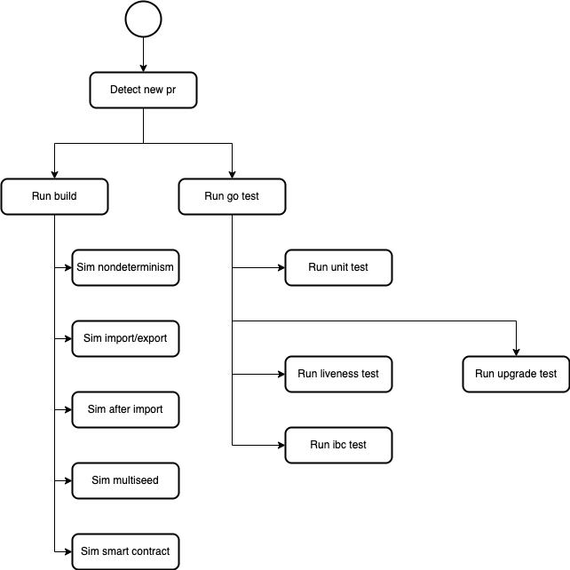

# I. Why we need to setup an automated testing framework?
In many cases, we have observed that unit test isn't enough to guarantee that the whole system will not break. We simply got lucky when Ed found a problem through his manual system testing that may not always happen.

In some cases, not even the unit test is correct due to writer misunderstanding of required logic.

# II. Framework
For a distributed system, the FLP theorem dictates properties of a consensus network
* Agreement: All correct nodes decide for the same value.
* Termination: All non-faulty processes eventually decide on a value in finite time.
* Validity: The decision value must be the input value of a node.

1. Standarize writing unit test (we can even go further with a ci to check). A PR should include:
* feature specification (in written markdown file in a folder called feature-request) (Gherkin language)
* unit test write

2. a full - fledged e2e test flow through ci that does following flow
* upgrade testing:
    * for chain (if exists, else use current terrad): do an upgrade gov test to newer chain binary
    * for wasm (if there are changes to wasm, else use current wasm files): change to newer wasm files
* regression testing (change to system should not break existing one)
    * backend: 
        * chain should run normal 
        * ibc should work normal
        * wasm should run normal
        * state sync should run normal
    * frontend: api testing of most important transaction types and query
* fuzz testing:
    * some nice background reading: https://github.com/osmosis-labs/osmosis/blob/main/simulation/ADR.md
    * we need to care only about events that invoke a state change, we then create randomized request to these events:
        * transaction: create randomized request and broadcast multiple times
        * begin block: randomized environment condition that invokes a begin block logic (Ex: system time, number of validators, ...)
        * end block: randomized environment condition that invokes an end block logic (Ex: system time, number of validators, ...)
        * init genesis: create randomized genesis state

It is hard to invoke a begin, end block logic without first understanding what environment condition it relies on.

# III. CI/CD

Details implementation for framework above

## Functional continous integration

Goal: 
* Quickly check for errors in code base
* Setting up e2e testing in golang instead of script allows much closer check on the chain inner working. It will also allow go test to use it.

This will affect currently test.yml and sims.yml

### Build environment

1. go test: see if the code passes all unit testing
    * check if newly created function has test with it (if not, error)
    * new unit test must aim to break and error, not aim to pass. We have enjoyed false positive from unit test. Recently, we have falsely believed that tax split test works due to favourable input.
    * I recently discovered that Terra wasm query testing doesn't work since Till provided it with blank contract bindings_tester.wasm and it still passes. That is way too false positive.
2. go build binary: see if the binary can be built.
3. liveness test:
    * liveness test is an __overall attack__ on FLP theorem by randomly shut down nodes.
    * we have four nodes which restarts one node each for every 30 sec. In a sense of local host network, this doesn't prove much since node can get back online fairly quickly in 5s. This is quick interval restart, less restarting.
    * we should aim for slow interval restart, more restarting (this actually reflects what is happening during mainnet upgrade where validators panic and restart a lot).
    * 7 nodes should be the ideal number of testing node: f < n/3 (so we can shut down 2 nodes at the same time).
    * currently script and docker -> future go.
4. upgrade test:
    * currently script and docker -> future go.
    * check that store has changed after upgrade.
5. ibc test: https://github.com/strangelove-ventures/interchaintest
    * normal ibc ics20-1 function

### Staging environment

6. fuzz test: 
    * test-sim-multi-seed-short
    * test-sim-multi-seed-long
    * test-sim-after-import
    * test-sim-import-export
    * test-sim-nondeterminism
    * test sim smart contract (for terra query request since we maintain a custom implementation of this)

## Non - functional continous integration

1. linting
2. proto
3. codeql

## Continous delivery

Goal: 
* check terrad in production environment. All layers rely on the chain should function normally. If not, propose migration code.

Question:
* how to actually do all this in an automatic fashion

### validator
1. statesync
2. snapshot

### Front - end
1. wallet functions normally
2. mantlemint functions normally
3. station functions normally
4. LocalTerra functions normally